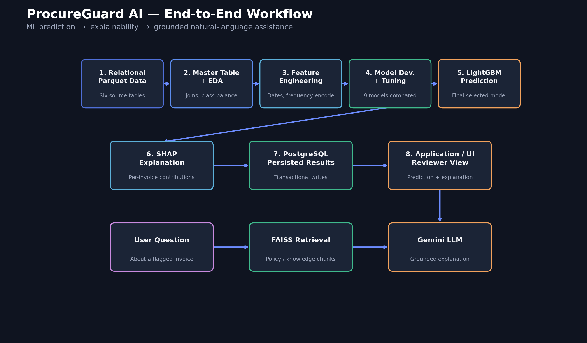
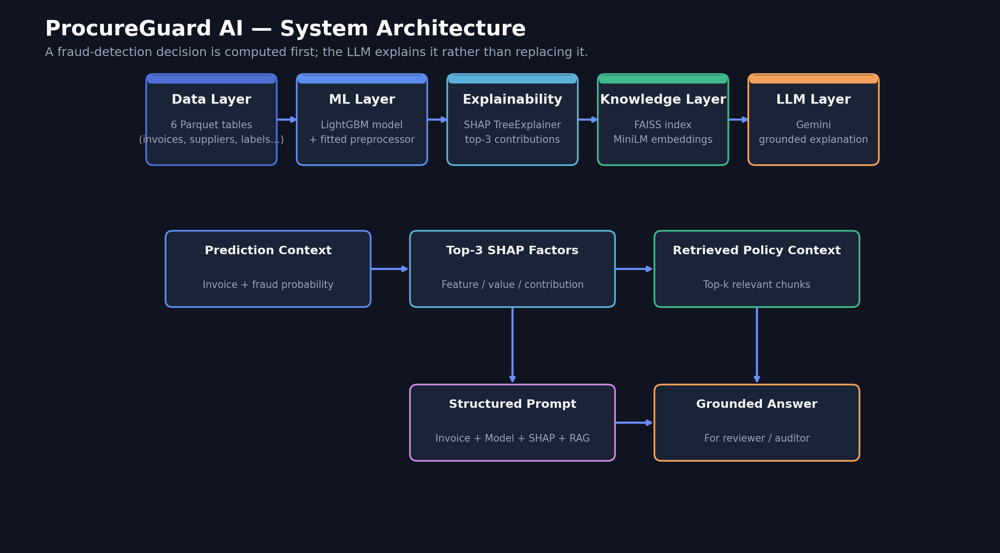
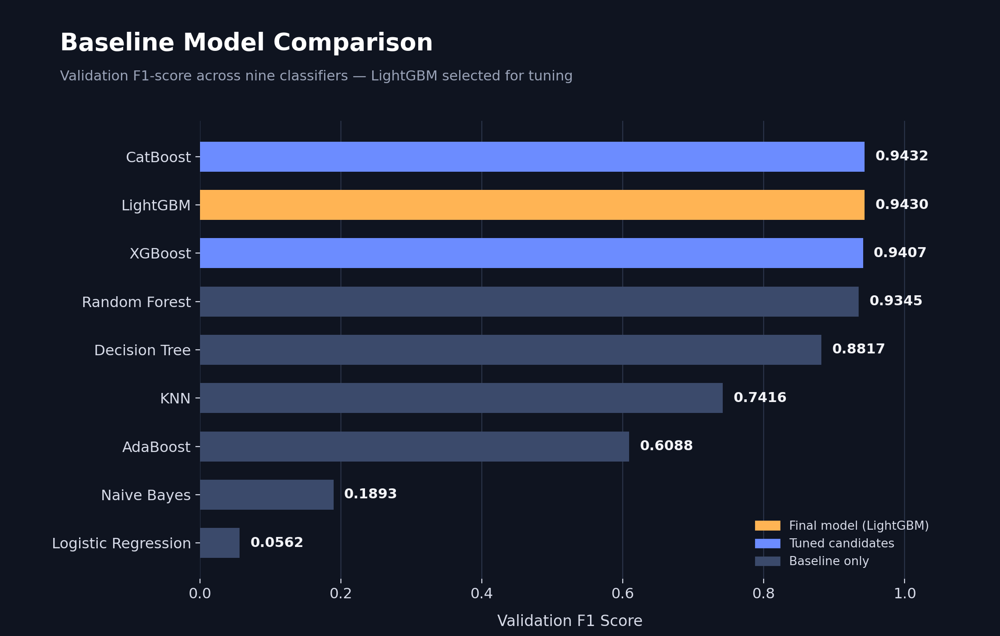
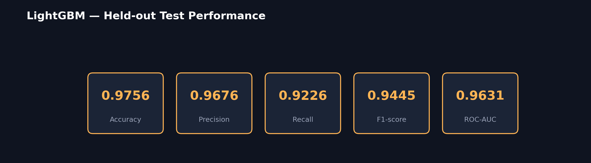

<div align="center">
🛡️ ProcureGuard AI
AI-Powered Procurement Invoice Fraud Detection & Explainability System
Detect → Explain → Ground → Assist


</div>
---
ProcureGuard AI is an end-to-end machine learning system that detects potentially
fraudulent procurement invoices, explains why an invoice was flagged, and produces a
grounded natural-language explanation using SHAP + RAG + Gemini.
It combines tabular ML, model explainability, retrieval-augmented generation, and an
application layer — so a fraud prediction isn't just a probability score, it's something
a reviewer can actually investigate.
---
📌 Overview
Procurement fraud hides inside seemingly normal invoices — unusual amounts, supplier
behaviour, timing patterns, and risk signals. ProcureGuard AI follows a layered pipeline:
> **Structured invoice data → EDA → Feature Engineering → ML Models → LightGBM → SHAP → RAG → Gemini → Reviewer-friendly explanation**
Core design principle:
> The ML model makes the fraud-risk prediction. SHAP explains the model. RAG supplies
> relevant procurement knowledge. Gemini communicates the combined evidence in plain
> language. **The LLM explains the decision — it never makes it.**
---
🚀 Key Features
	
📊	300,000 procurement invoices across a normalized, relational-style dataset
🗂️	Six Parquet tables — invoices, behavioural features, labels, splits, suppliers, departments
🔎	Full EDA — class imbalance, missing values, distributions, correlations, fraud trends
🧠	Feature engineering from invoice dates and supplier behaviour
🤖	Nine ML classifiers compared head-to-head
⚡	Hyperparameter tuning via `RandomizedSearchCV` (3-fold CV)
🏆	Final LightGBM model, selected on validation F1
📈	Fraud-focused evaluation — Precision, Recall, F1, ROC-AUC
🔍	SHAP TreeExplainer for per-invoice explanations
📚	RAG pipeline — chunking, Hugging Face embeddings, FAISS
🧠	Gemini for grounded natural-language explanations
🛡️	Prompt guardrails against hallucinated fraud claims
🔗	Source-aware answers grounded in retrieved policy documents
---
🏗️ End-to-End Workflow

Load the data — read six Parquet tables, build one master table via left joins.
EDA — shape, dtypes, missing values, duplicates, class balance, correlations, fraud-rate trends over time.
Engineer features — `invoice_month`, `invoice_weekday`, `invoice_quarter`, `is_weekend`; frequency-encode `supplier_id` on training data only.
Preprocess — one-hot encode low-cardinality categoricals, pass numerics through, fit only on train.
Train & compare — Logistic Regression, Decision Tree, KNN, Naive Bayes, Random Forest, AdaBoost, XGBoost, LightGBM, CatBoost.
Tune the top 3 — XGBoost, LightGBM, CatBoost via `RandomizedSearchCV`, selection metric F1.
Final prediction — LightGBM selected on validation performance, evaluated once on held-out test data.
Explain — SHAP `TreeExplainer` computes per-feature contributions; production output keeps the top 3.
Answer reviewer questions — FAISS retrieves relevant policy chunks; invoice + prediction + SHAP + retrieved knowledge are combined into a structured prompt; Gemini generates the explanation.
---
🧩 System Architecture

Layer	Responsibility
Data Layer	Stores the normalized procurement dataset
ML Layer	Preprocessing, model training, tuning, prediction
Explainability Layer	Generates SHAP-based feature contributions
Knowledge Layer	Retrieves relevant procurement-policy information
LLM Layer	Converts evidence into a human-readable explanation
Application Layer	Presents predictions and explanations to reviewers
---
📦 Dataset
Six Parquet tables make up the normalized procurement dataset:
Table	Purpose
`invoices`	Core invoice transaction information
`behavioural_features`	Supplier / invoice behavioural signals
`labels`	Fraud target (`is_fraud`) and related labels
`splits`	Train / validation / test assignment
`suppliers`	Supplier information
`departments`	Department information
Manifest: 2,000 suppliers · 50 departments · 300,000 invoices · 300,000 behavioural
feature rows · 300,000 label rows · 45,000 invoice images.
Parquet was chosen because it's columnar, compressed, preserves dtypes, and suits
structured multi-table processing.
---
🔍 Exploratory Data Analysis
The master dataset: 300,000 rows × 28 columns.
`image_path` missing for 255,000 invoices (85%) — only 45,000 invoices have images.
0 duplicate rows, 0 duplicate `invoice_id` values.
Target is imbalanced: 77.86% non-fraud vs 22.14% fraud.
Fraud rate holds steady across splits: Train 21.97%, Validation 22.58%, Test 22.52% — confirming the split preserves class distribution well.
Features with the strongest fraud/non-fraud separation: `invoice_amount`,
`blacklisted_flag`, `supplier_avg_amount_90d`, `supplier_invoice_count_30d`,
`late_night_submission_flag`, `supplier_risk_score`.
---
🛠️ Feature Engineering & Data Preparation
Derived date features (from `invoice_date`): `invoice_month`, `invoice_weekday`,
`invoice_quarter`, `is_weekend` — exposing calendar patterns a tree-based model can use directly.
Supplier frequency encoding: instead of one-hot encoding `supplier_id`, frequency is
computed only on the training set and mapped onto validation/test — avoiding leakage
while keeping the feature space compact.
Removed columns (identifiers, non-tabular fields, post-outcome/leakage-prone fields,
helper columns): `invoice_id`, `department_id`, `image_path`, `fraud_type`, `fraud_tags`,
`explanations`, `invoice_date`, `currency`, `split`, `duplicate_invoice_flag`, `split_invoice_flag`.
---
🤖 Machine Learning

Model	Validation F1
CatBoost	0.9432
LightGBM	0.9430
XGBoost	0.9407
Random Forest	0.9345
Decision Tree	0.8817
KNN	0.7416
AdaBoost	0.6088
Naive Bayes	0.1893
Logistic Regression	0.0562
CatBoost, LightGBM, and XGBoost — the three strongest — were carried forward for
hyperparameter tuning.
⚙️ Hyperparameter Tuning
`RandomizedSearchCV` applied to XGBoost, LightGBM, and CatBoost:
```text
Iterations:        20
Cross-validation:  3-fold
Scoring:           F1
```
Randomized search was chosen to explore a wider hyperparameter space without the full
cost of exhaustive Grid Search.
🏆 Final Model — LightGBM
```text
Validation F1  = 0.943958
ROC-AUC        = 0.9632
```
Test Performance

Validation and test F1 stay close (0.9440 vs 0.9445) — good evidence of
generalization rather than a large train/test gap.
🎯 Why F1-score?
Fraud is a minority class, so accuracy alone can mislead — a model predicting almost
everything as legitimate could still score well on accuracy while missing real fraud.
F1 balances precision (how many flagged invoices are actually fraud) against
recall (how much of the actual fraud gets caught). ROC-AUC is reported alongside it
to measure ranking quality across thresholds.
---
🔎 Explainability with SHAP
```text
Raw Invoice → Saved Preprocessor → Processed Features → SHAP TreeExplainer
            → Feature Contributions → Top-3 Influential Features → Stored Explanation
```
For each invoice, the system ranks features by the magnitude of their SHAP values and
keeps the top 3 — enough for a concise reviewer-facing explanation without dumping
every model feature. Explanations are persisted to a PostgreSQL table alongside the
invoice's processing status.
> **Design choice:** SHAP explains the already-computed ML prediction. It never makes
> the fraud decision itself.
---
📚 RAG + LLM Explanation Layer
Answers reviewer questions like "Why was this invoice flagged?" by combining three
sources of evidence: invoice data, the pre-computed SHAP explanation, and
relevant procurement-policy knowledge retrieved from the knowledge base.
```text
User Question → Document Retrieval → FAISS Similarity Search → Top-k Relevant Chunks
             → Invoice Context + SHAP + Retrieved Policy → Structured Prompt
             → Gemini → Grounded Natural-Language Explanation
```
Document processing — the knowledge base supports `.pdf`, `.md`, `.txt`; documents
are recursively loaded and tagged with filename, category (derived from parent folder),
and source path.
Chunking — 800-character chunks, 200-character overlap, recursive splitting that
prioritizes paragraph → line → sentence → space → character boundaries.
Embeddings — `sentence-transformers/all-MiniLM-L6-v2`, lightweight and suited to
local CPU-based retrieval; embeddings are normalized before indexing.
Retrieval — FAISS local vector index, similarity search with k = 5. The index is
built offline and loaded at application start rather than rebuilt per request.
---
💬 Gemini Explanation Layer
```text
Role / Persona + Invoice Details + Model Prediction + SHAP Explanation
    + Retrieved Knowledge + User Question → Grounded Answer
```
Guardrails: never claim an invoice is certainly fraudulent · explain why the model
considered it risky · never invent facts · keep answers concise · ground everything in
supplied invoice/model/retrieved evidence.
Temperature: `0.2` — favors consistent, focused responses over creative variation.
Example — instead of:
> ❌ *"This invoice is definitely fraudulent."*
the system says:
> ✅ *"The model considered this invoice high-risk primarily because of the unusually
> high invoice amount, late-night submission pattern, and supplier-related risk
> indicators."*
Grounded in actual model output and retrieved knowledge — not the LLM guessing why fraud occurred.
---
🧱 Technology Stack
Category	Tools
Data & Processing	Python, Pandas, NumPy, Parquet
Machine Learning	Scikit-learn, LightGBM, XGBoost, CatBoost
Explainable AI	SHAP, TreeExplainer
RAG	LangChain, Hugging Face Sentence Transformers, FAISS
LLM	Google Gemini API
Backend / Persistence	FastAPI, PostgreSQL, serialized model artifacts
Visualization	Matplotlib, Seaborn
---
📁 Project Structure
```text
ProcureGuard-AI/
│
├── app/
│   ├── services/
│   │   ├── prediction/
│   │   ├── shap_service.py
│   │   ├── context_service.py
│   │   ├── rag/
│   │   │   ├── loader.py
│   │   │   ├── splitter.py
│   │   │   ├── embeddings.py
│   │   │   ├── vector_store.py
│   │   │   ├── retriever.py
│   │   │   ├── prompt_builder.py
│   │   │   └── llm_service.py
│   │   └── ...
│   └── ...
│
├── knowledge_base/
│   ├── policies/
│   ├── guidelines/
│   └── case_studies/
│
├── models/
│   ├── best_model.pkl
│   └── preprocessor.pkl
│
├── notebooks/
│   ├── EDA/
│   ├── model_development/
│   └── SHAP/
│
├── app/vector_db/
│   └── faiss_index/
│
├── requirements.txt
├── .env
└── README.md

🔐 Environment Variables
```env
GOOGLE_API_KEY=your_api_key
GEMINI_MODEL=your_model_name
▶️ Running the Project
1. Clone the repository
```bash
git clone <your-repository-url>
cd ProcureGuard-AI
```
2. Create a virtual environment
```bash
python -m venv venv
```
Activate it — Windows: `venv\Scripts\activate` · Linux/macOS: `source venv/bin/activate`
3. Install dependencies
```bash
pip install -r requirements.txt
```
4. Configure environment variables — create `.env` with your Gemini/database settings.
5. Prepare model artifacts — the trained model and fitted preprocessor
(`best_model.pkl`, `preprocessor.pkl`) are exported so inference uses the same
preprocessing representation as training.
6. Build / update the RAG index — rebuild the FAISS vector store whenever new policy
documents are added.
7. Start the application — via the project's configured FastAPI entry point.
---
🔄 Production Processing Flow
```text
Invoice Upload → Data Extraction / Context Assembly → Preprocessing
    → LightGBM Prediction → Fraud Probability → SHAP Explanation
    → Top-3 Influential Features → Store Prediction + Explanation
    → Reviewer asks a question → RAG Retrieval → Gemini Explanation
```
The SHAP service follows a transactional pattern, so failures roll back database changes
instead of leaving partial writes.
---
⚠️ Known Engineering Considerations
Issue	Detail
Embedding consistency	Index-building and query-time embedding config should match — a normalization mismatch currently exists and should be standardized on one shared config.
Path handling	Some modules resolve paths relative to CWD, others relative to the source file — a shared config/path module would make the app portable across local, Docker, and deployment environments.
Gemini error handling	LLM calls need robust exception handling for invalid keys, rate limits, network failures, and unavailable models.
Vector index refresh	Adding a knowledge-base document doesn't auto-update the FAISS index — the index-building step must be rerun manually.
---
📈 Future Improvements
Apply SMOTE or class weighting for explicit imbalance handling
Threshold tuning instead of relying on the default 0.5
Formal model feature-importance reporting
Improve RAG embedding/index consistency
Standardize project path configuration
Stronger Gemini retry/error handling
Automated FAISS re-indexing when policy documents change
Model/version tracking for production artifacts
Multimodal processing of the available invoice images
---
🎯 Project Impact
ProcureGuard AI moves beyond a traditional `Invoice → Fraud / Not Fraud` classifier:
```text
Invoice → Risk Prediction → Why? → SHAP Evidence
    → What policy/context is relevant? → RAG Retrieval
    → How should a reviewer understand it? → Gemini Explanation
```
This makes the system suited for audit, compliance, and human-in-the-loop review —
where a prediction needs supporting evidence rather than being treated as an
unquestionable decision.
---
📊 Results at a Glance
Component	Result
Dataset size	300,000 invoices
Fraud rate	22.137%
Best model	LightGBM
Test Accuracy	97.56%
Test Precision	96.76%
Test Recall	92.26%
Test F1	94.45%
Test ROC-AUC	96.31%
Explainability	SHAP, per-invoice
Vector Store	FAISS
Embeddings	all-MiniLM-L6-v2
LLM	Google Gemini
RAG Retrieval	Top-5 similarity search
---
<div align="center">
👨‍💻 Project Philosophy
Detect → Explain → Ground → Assist
ProcureGuard AI combines machine learning with explainable AI and retrieval-augmented
generation to make procurement fraud detection transparent and actionable.
---
⭐ If you find this project useful, give the repository a star.
</div>
